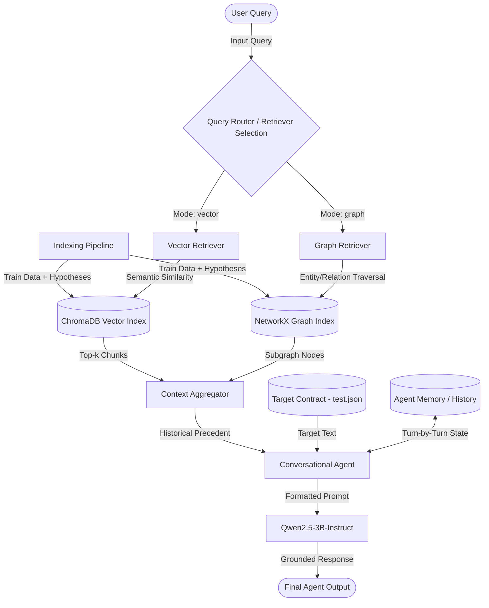

# Milestone 2: Multi-Agent Architecture Report

## 1. System Overview
This report outlines the architecture of our multi-agent system designed for legal document analysis (specifically NDA review), as implemented in Milestone 2. The system integrates Vector-based RAG, Graph-based RAG, and a Stateful Conversational Agent to provide accurate, grounded, and context-aware natural language interactions.

## 2. Agentic Architecture Diagram

## 3. Core Components

### 3.1 Vector Retriever
- **Technology:** ChromaDB, `sentence-transformers` (`all-MiniLM-L6-v2`).
- **Functionality:** Embeds text chunks (hypotheses + clauses + outcomes) to capture the semantic meaning of past legal interpretations. When a user asks a question, the Vector Retriever queries ChromaDB for the top-k most semantically similar historical precedents.
- **Constraints:** Executed on CPU to save GPU memory for the main LLM on Kaggle. Insertions are batched to avoid upper limits (`Max batch size of 5461`).

### 3.2 Graph Retriever
- **Technology:** NetworkX, Pickled Graph.
- **Functionality:** Maps entities such as `Clause` and `Hypothesis` as nodes connected by `Relation` edges. This provides explicit, structured linkages between contract text and legal interpretations, which is highly beneficial for multi-hop legal reasoning.
- **Retrieval Mechanism:** Uses vector embeddings to find the closest entry nodes in the graph, then extracts surrounding subgraphs (connected clauses and hypotheses) to build the context.

### 3.3 Stateful Conversational Agent
- **Technology:** HuggingFace `transformers`, `BitsAndBytesConfig` (4-bit quantization), `Qwen/Qwen2.5-3B-Instruct`.
- **Functionality:** Acts as the primary decision-maker and conversational interface.
- **State Management:** Employs a `history` array to track the user and assistant turns, dynamically mapping it to the target Chat Template.
- **Grounding & Prompting:** The prompt strictly enforces grounding by physically separating the "Target Contract Text" from the "Historical Precedents (External RAG Context)". The system prompt instructs the agent to only use the RAG context to understand *how* similar clauses were interpreted, but to base its final answer *strictly* on the Target Contract Text.

## 4. Execution Flow
1. **Contract Loading:** The orchestrator loads a target contract from `test.json`.
2. **Retrieval:** Based on the selected routing mode (`vector` or `graph`), the corresponding retriever fetches relevant historical context from the indexing databases based on the user's initial query.
3. **Agent Invocation:** 
   - On the first turn, the Agent evaluates the original target contract text alongside the historical precedents and answers the user.
   - On subsequent turns, the Agent retains state (memory) to answer follow-up queries contextually.
4. **Evaluation & Output:** Outputs can be formatted against the 17 hypothesis labels from ContractNLI to measure F1-Scores and strict classification metrics and saved to `runtrace_output.json`.
