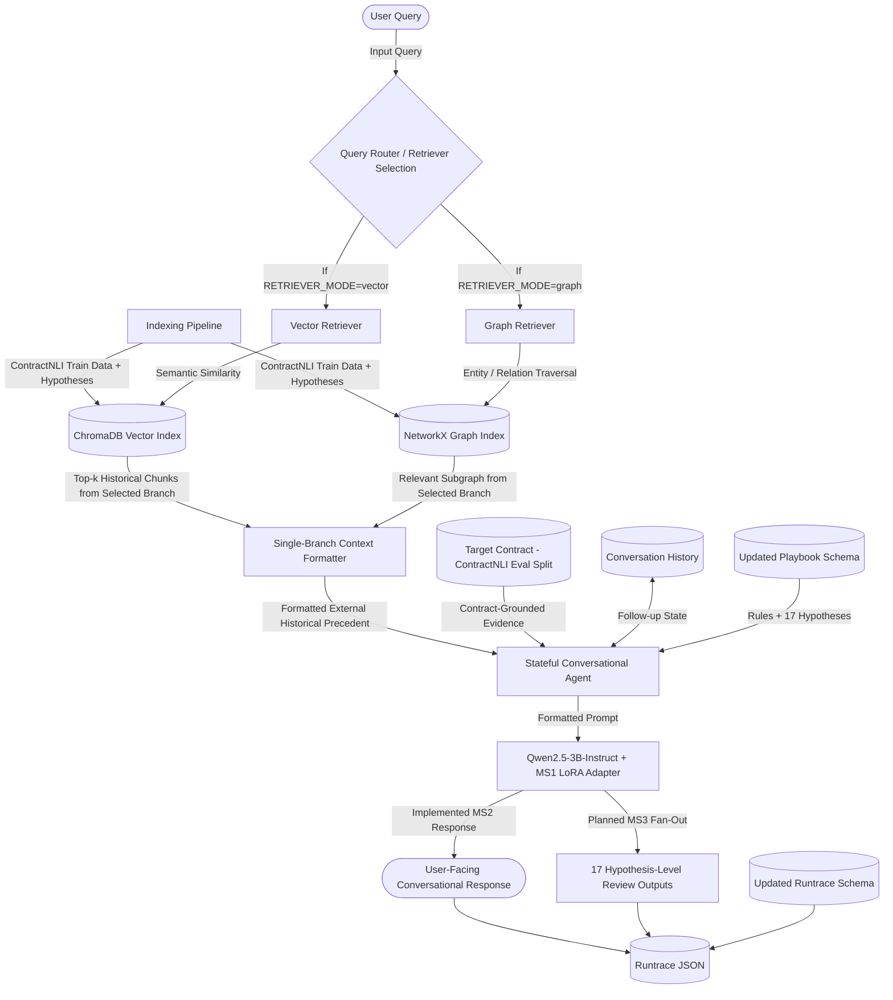

```mermaid
graph TD
    User([User Query]) --> |Input Query| Router{Query Router / Retriever Selection}

    subindex[Indexing Pipeline]
    subindex --> |ContractNLI Train Data + Hypotheses| VectorDB[(ChromaDB Vector Index)]
    subindex --> |ContractNLI Train Data + Hypotheses| GraphDB[(NetworkX Graph Index)]

    Router --> |If RETRIEVER_MODE=vector| VR[Vector Retriever]
    Router --> |If RETRIEVER_MODE=graph| GR[Graph Retriever]

    VR --> |Semantic Similarity| VectorDB
    GR --> |Entity / Relation Traversal| GraphDB

    VectorDB --> |Top-k Historical Chunks from Selected Branch| ContextAgg[Single-Branch Context Formatter]
    GraphDB --> |Relevant Subgraph from Selected Branch| ContextAgg

    ContextAgg --> |Formatted External Historical Precedent| Agent[Stateful Conversational Agent]
    TargetContract[(Target Contract - ContractNLI Eval Split)] --> |Contract-Grounded Evidence| Agent
    Memory[(Conversation History)] <--> |Follow-up State| Agent
    Playbook[(Updated Playbook Schema)] --> |Rules + 17 Hypotheses| Agent

    Agent --> |Formatted Prompt| LLM[Qwen2.5-3B-Instruct + MS1 LoRA Adapter]
    LLM --> |Implemented MS2 Response| Output([User-Facing Conversational Response])
    LLM --> |Planned MS3 Fan-Out| HypAgents[17 Hypothesis-Level Review Outputs]

    Output --> Runtrace[(Runtrace JSON)]
    HypAgents --> Runtrace
    RuntraceSchema[(Updated Runtrace Schema)] --> Runtrace
```
