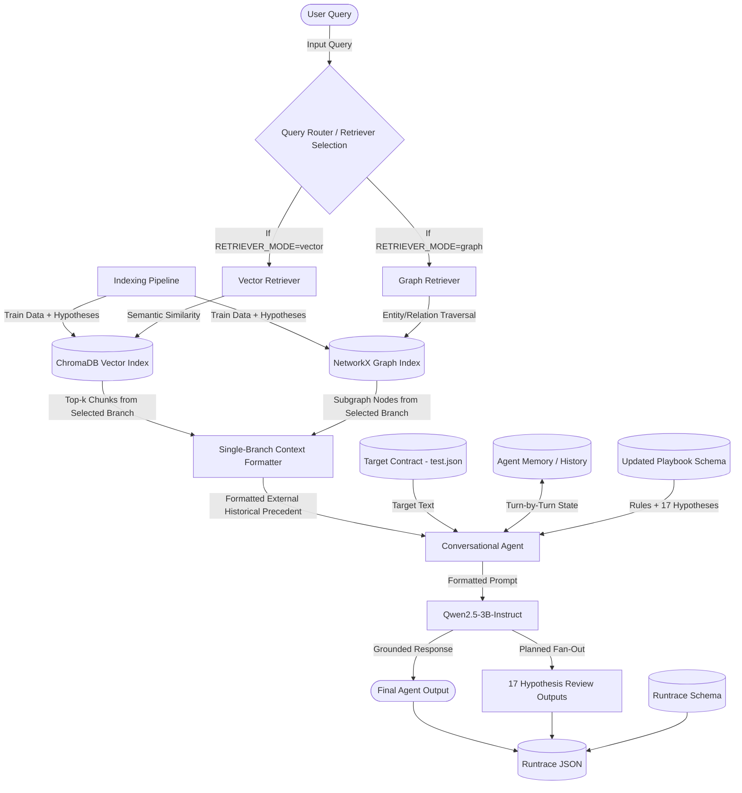

# Milestone 2: Multi-Agent Architecture Report

## 1. System Overview
This report outlines the architecture of our multi-agent system designed for legal document analysis (specifically NDA review), as implemented in Milestone 2. The system includes both Vector-based RAG and Graph-based RAG, but a single run routes through exactly one retrieval branch. The selected branch provides external historical precedent to a Stateful Conversational Agent, which produces grounded and context-aware natural language interactions.

## 2. Implemented vs. Architectural Scope

Milestone 2 implements the vector RAG pipeline, GraphRAG pipeline, conversational agent, retrieval routing, conversation-history preservation, and runtrace logging scaffold. The complete 17-hypothesis review fan-out, playbook-governed specialist agents, and full evaluation metrics are included in the target architecture for Milestone 3 and represented as schema-backed placeholders in the Milestone 2 runtrace.

## 3. Agentic Architecture Diagram

## 4. Core Components

### 4.1 Vector Retriever
- **Technology:** ChromaDB, `sentence-transformers` (`all-MiniLM-L6-v2`).
- **Functionality:** Embeds text chunks (hypotheses + clauses + outcomes) to capture the semantic meaning of past legal interpretations. When a user asks a question, the Vector Retriever queries ChromaDB for the top-k most semantically similar historical precedents.
- **Constraints:** Executed on CPU to save GPU memory for the main LLM on Kaggle. Insertions are batched to avoid upper limits (`Max batch size of 5461`).

### 4.2 Graph Retriever
- **Technology:** NetworkX, Pickled Graph.
- **Functionality:** Maps entities such as `Clause` and `Hypothesis` as nodes connected by `Relation` edges. This provides explicit, structured linkages between contract text and legal interpretations, which is highly beneficial for multi-hop legal reasoning.
- **Retrieval Mechanism:** Uses vector embeddings to find the closest entry nodes in the graph, then extracts surrounding subgraphs (connected clauses and hypotheses) to build the context.

### 4.3 Retrieval Router and Single-Branch Context Formatter
- **Routing Rule:** A Milestone 2 run must use exactly one retrieval branch: either Vector RAG or GraphRAG. The notebook implements this with `RETRIEVER_MODE`, which selects `vector` or `graph`.
- **No Retrieval Merging:** The context formatter does not combine vector and graph outputs in the same run. It only normalizes and formats the context returned by the selected retriever before passing it to the conversational agent.
- **Reason for Keeping Both Branches in the Diagram:** Both retrieval modes are required Milestone 2 implementations. The diagram shows both available branches, while the router edge labels make clear that only one branch is active per run.

### 4.4 Stateful Conversational Agent
- **Technology:** HuggingFace `transformers`, `BitsAndBytesConfig` (4-bit quantization), `Qwen/Qwen2.5-3B-Instruct`.
- **Functionality:** Acts as the primary decision-maker and conversational interface.
- **State Management:** Employs a `history` array to track the user and assistant turns, dynamically mapping it to the target Chat Template.
- **Grounding & Prompting:** The prompt strictly enforces grounding by physically separating the "Target Contract Text" from the "Historical Precedents (External RAG Context)". The system prompt instructs the agent to only use the RAG context to understand *how* similar clauses were interpreted, but to base its final answer *strictly* on the Target Contract Text.

### 4.5 Updated Playbook
- **Schema file:** `assets/playbook_ms2.schema.json`.
- **Functionality:** Defines the required playbook structure for the target architecture, including the 17 ContractNLI hypothesis outputs, responsible agents, allowed labels, retrieval policy, grounding policy, conversation policy, and runtrace contract.
- **Milestone 2 Status:** The schema is defined; the full playbook instance and 17-way reasoning execution remain planned architecture work.

### 4.6 Updated Runtrace Schema
- **Schema file:** `assets/runtrace_ms2.schema.json`.
- **Functionality:** Defines the run-level evidence trail for retrieval mode, conversation history, contract identity, playbook metadata, hypothesis traces, metrics, and validations.
- **Milestone 2 Status:** The notebook emits the scaffolded runtrace. The schema permits either an empty `hypothesis_traces` array for the Milestone 2 placeholder state or exactly 17 hypothesis traces for the full target architecture.
- **Validation Note:** The Milestone 2 PDF requires defining the updated playbook schema and runtrace schema and explaining how they fit the architecture. It does not explicitly require runtime validation of generated outputs against those schemas. Runtime validation is therefore treated as an optional implementation check in Milestone 2 and can be expanded into a stricter required workflow in Milestone 3.

## 5. Execution Flow
1. **Contract Loading:** The orchestrator loads a target contract from `test.json`.
2. **Retrieval Routing:** Based on the selected routing mode (`vector` or `graph`), the orchestrator activates exactly one retriever for the run.
3. **Single-Branch Context Formatting:** The selected retriever's output is normalized into a historical-precedent context block. Vector and graph retrieval outputs are not merged in the same run.
4. **Agent Invocation:** 
   - On the first turn, the Agent evaluates the original target contract text alongside the historical precedents and answers the user.
   - On subsequent turns, the Agent retains state (memory) to answer follow-up queries contextually.
5. **Runtrace Output:** The implemented notebook saves the conversational runtrace to `results_ms2_runtrace.json` using the structure defined by `assets/runtrace_ms2.schema.json`. Validation against the schema is optional support code rather than a stated Milestone 2 grading requirement.
6. **Planned Evaluation:** In the complete target system, outputs will be formatted against the 17 ContractNLI hypothesis labels to measure F1 scores and strict classification metrics.
