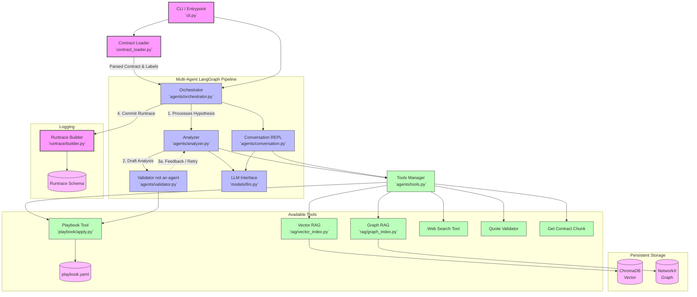

# MS3 Architecture Diagram

```mermaid
graph TD
    classDef main fill:#f9f,stroke:#333,stroke-width:2px;
    classDef agent fill:#bbf,stroke:#333,stroke-width:1px;
    classDef tool fill:#bfb,stroke:#333,stroke-width:1px;
    classDef data fill:#fbf,stroke:#333,stroke-width:1px;
    classDef ext fill:#ddd,stroke:#333,stroke-width:1px;

    CLI[CLI / Entrypoint<br/>`cli.py`]:::main
    Loader[Contract Loader<br/>`contract_loader.py`]:::main

    CLI --> Loader

    subgraph Logging
        Runtrace[Runtrace Builder<br/>`runtrace/builder.py`]:::main
        RuntraceSchema[(Runtrace Schema)]:::data
        Runtrace --> RuntraceSchema
    end

    subgraph Multi-Agent LangGraph Pipeline
        Orchestrator[Orchestrator<br/>`agents/orchestrator.py`]:::agent
        Analyzer[Analyzer<br/>`agents/analyzer.py`]:::agent
        Validator[Validator not an agent<br/>`agents/validator.py`]:::agent
        Conversation[Conversation REPL<br/>`agents/conversation.py`]:::agent
        LLM[LLM Interface<br/>`models/llm.py`]:::agent
        Analyzer --> LLM
        Conversation --> LLM
    end

    Loader -->|Parsed Contract & Labels| Orchestrator
    CLI --> Orchestrator
    Orchestrator --> Conversation

    Orchestrator -->|1. Processes Hypothesis| Analyzer
    Analyzer -->|2. Draft Analysis| Validator
    Validator -.->|3a. Feedback / Retry| Analyzer
    Orchestrator -->|4. Commit Runtrace| Runtrace

    Tools[Tools Manager<br/>`agents/tools.py`]:::tool
    Analyzer --> Tools
    Conversation --> Tools

    subgraph Available Tools
        VRAG[Vector RAG<br/>`rag/vector_index.py`]:::tool
        GRAG[Graph RAG<br/>`rag/graph_index.py`]:::tool
        PlaybookTool[Playbook Tool<br/>`playbook/apply.py`]:::tool
        PlaybookFile[(playbook.yaml)]:::data
        PlaybookTool --> PlaybookFile
        WebSearch[Web Search Tool]:::tool
        ValidatorTool[Quote Validator]:::tool
        GetChunk[Get Contract Chunk]:::tool
    end
    
    subgraph Persistent Storage
        Chroma[(ChromaDB<br/>Vector)]:::data
        NetworkX[(NetworkX<br/>Graph)]:::data
    end
    
    VRAG --> Chroma
    GRAG --> NetworkX

    Tools --> VRAG
    Tools --> GRAG
    Tools --> PlaybookTool
    Validator --> PlaybookTool
    Tools --> WebSearch
    Tools --> ValidatorTool
    Tools --> GetChunk


```
